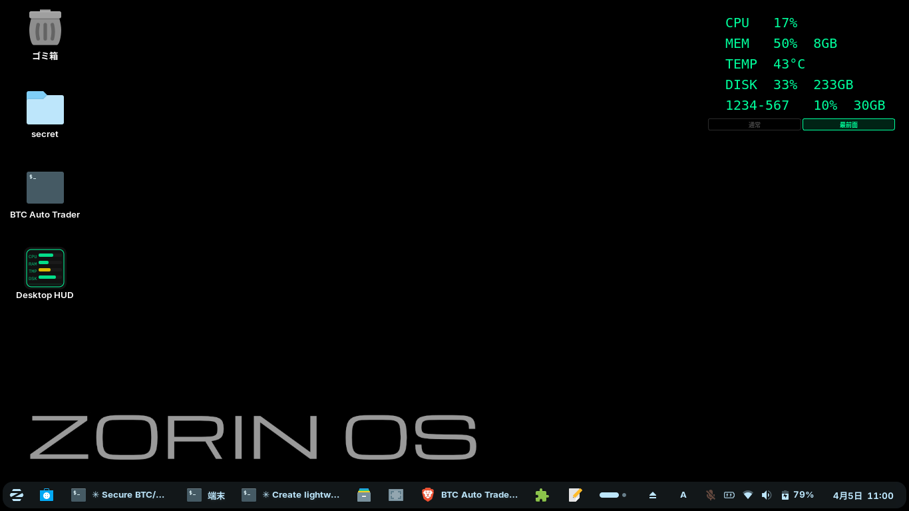

# Desktop HUD

CPU・メモリ・温度・ストレージ使用率を、デスクトップ最前面に  
**文字だけ浮いて見える HUD 風**でリアルタイム表示する軽量モニタリングアプリです。

Ubuntu 系 Linux / Zorin OS 向けに作られています。

---

## スクリーンショット



---

## 動作環境

| 項目 | 要件 |
|------|------|
| OS | Ubuntu 22.04 以降 / Zorin OS 16 以降（他 Ubuntu 系 Linux も可） |
| Python | 3.10 以上 |

### 事前に apt でインストールが必要なパッケージ

```bash
sudo apt install python3 python3-venv python3-pip libxcb-cursor0
```

| パッケージ | 用途 |
|-----------|------|
| `python3` | Python 本体 |
| `python3-venv` | 仮想環境の作成（install.sh が確認する） |
| `python3-pip` | pip によるライブラリ管理 |
| `libxcb-cursor0` | PySide6 が Qt の XCB バックエンドで起動する際に必要。ないと `qt.qpa.plugin: Could not load the Qt platform plugin "xcb"` エラーが出る場合がある |

---

## インストール手順

### 1. リポジトリを clone する

```bash
git clone https://github.com/あなたのユーザー名/desktop-hud.git ~/desktop_hud
cd ~/desktop_hud
```

### 2. 事前パッケージをインストールする

```bash
sudo apt install python3 python3-venv python3-pip libxcb-cursor0
```

### 3. install.sh を実行する

```bash
bash install.sh
```

install.sh が自動で行うこと：

- `python3` / `python3-venv` の確認
- `.venv` 仮想環境の作成
- `PySide6` / `psutil` のインストール
- `~/.local/share/applications/desktop-hud.desktop` の生成（アプリメニュー登録）
- `~/デスクトップ/Desktop HUD.desktop` の生成（デスクトップアイコン）
- 実行権限の付与

ログイン時の自動起動も同時に有効にしたい場合：

```bash
bash install.sh --autostart
```

### 4. 起動する

デスクトップアイコンをダブルクリック、または：

```bash
~/desktop_hud/run_desktop_hud.sh
```

> **初回起動時の注意（Zorin OS / GNOME）**  
> デスクトップアイコンをダブルクリックすると「信頼されていない…」ダイアログが  
> 表示される場合があります。「**起動を信頼する（Trust and Launch）**」を選んでください。  
> 以降は普通にダブルクリックで起動できます。

---

## 機能

| 機能 | 説明 |
|------|------|
| HUD 表示 | CPU / MEM / TEMP / DISK を常に最前面に表示 |
| 外部ストレージ | USB メモリ等を自動検出して表示 |
| 表示 ON/OFF | 右クリック → 設定 で各項目を切り替え |
| 文字サイズ変更 | 設定ウィンドウの SpinBox で 8〜24pt |
| レイヤー切替 | HUD 下部の「通常」「最前面」ボタンで切替 |
| ドラッグ移動 | HUD を左ドラッグで好きな位置へ移動 |
| 色警告 | 70% 以上でゴールド、90% 以上でレッド表示 |

---

## 操作方法

| 操作 | 動作 |
|------|------|
| 左ドラッグ | HUD を移動 |
| 右クリック | コンテキストメニュー（設定・レイヤー切替・終了） |
| 「通常」ボタン | 最前面固定を解除（他ウィンドウの後ろに回せる） |
| 「最前面」ボタン | 最前面固定に戻す |

---

## 自動起動の設定

インストール時にまとめて設定する場合：

```bash
bash install.sh --autostart
```

インストール後に手動で設定する場合：

```bash
mkdir -p ~/.config/autostart
cp ~/.local/share/applications/desktop-hud.desktop ~/.config/autostart/
```

無効にしたいときは削除するだけです：

```bash
rm ~/.config/autostart/desktop-hud.desktop
```

---

## アンインストール

```bash
# デスクトップアイコンを削除
rm -f ~/デスクトップ/"Desktop HUD.desktop"

# アプリメニューから削除
rm -f ~/.local/share/applications/desktop-hud.desktop

# 自動起動を設定していた場合
rm -f ~/.config/autostart/desktop-hud.desktop

# アプリ本体を削除
rm -rf ~/desktop_hud
```

---

## ファイル構成

```
desktop_hud/
├── app.py                 # アプリ本体
├── icon.svg               # HUD アイコン
├── install.sh             # インストールスクリプト
├── run_desktop_hud.sh     # 起動スクリプト（.desktop から呼ばれる）
├── requirements.txt       # Python 依存ライブラリ
├── LICENSE                # MIT ライセンス
├── README.md              # このファイル
└── .gitignore
```

---

## 依存ライブラリ

| ライブラリ | 用途 |
|-----------|------|
| [PySide6](https://pypi.org/project/PySide6/) | GUI フレームワーク（Qt6） |
| [psutil](https://pypi.org/project/psutil/) | システム情報取得 |

---

## ライセンス

MIT — 詳細は [LICENSE](LICENSE) を参照してください。
